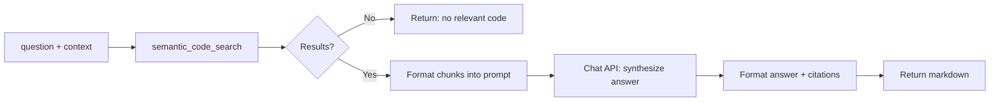
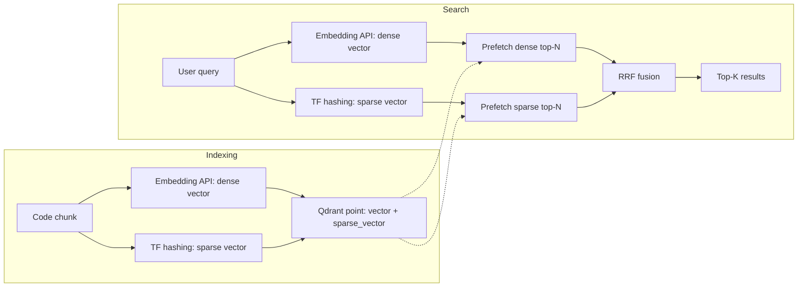
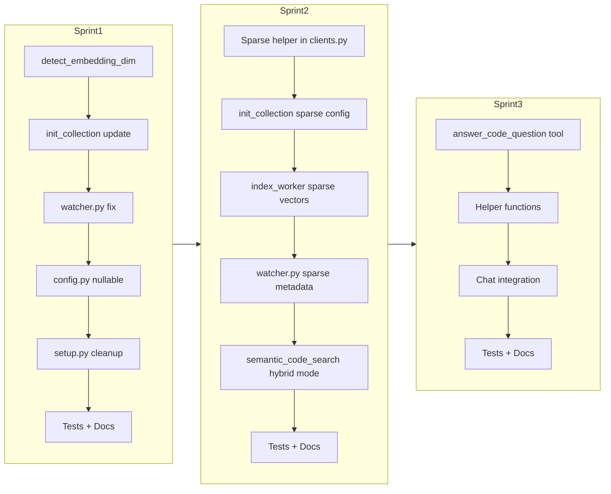

# Hivemind — Top 3 Feature Implementation Plan

## Priority Ranking

| Rank | Feature | Impact | Effort | Why Now |
|------|---------|--------|--------|---------|
| 1 | **Auto-Detect Embedding Dimensions** | Removes setup friction, prevents misconfig | ~1 day | User-requested; touches config, clients, setup wizard |
| 2 | **RAG-Style Code Q&A** (MCP tool) | Transforms search -> assistant | ~1-2 days | Leverages existing chat client + search |
| 3 | **Hybrid Search** (Keyword + Vector) | Drastically improves recall for exact queries | ~1-2 days | Uses existing Qdrant sparse vector + RRF fusion |

---

## Feature 1: Auto-Detect Embedding Dimensions

### Goal

Remove the manual `embedding_dim` configuration by deriving the vector dimension automatically from a single probe embedding request to the model API.

### Files to Modify

| File | Change | Type |
|------|--------|------|
| [`core/clients.py`](core/clients.py) | Add `detect_embedding_dim()` function; update `init_collection()` | New + Modify |
| [`core/config.py`](core/config.py:61-64) | Make `EmbeddingSettings.embedding_dim` optional (`Optional[int] = None`) | Modify |
| [`indexer/watcher.py:208`](indexer/watcher.py:208) | Replace `settings.model.embedding_dim` with `detect_embedding_dim()` | Modify |
| [`cli/setup.py:89`](cli/setup.py:89) | Remove dimension prompt from wizard | Modify |
| [`cli/features_command.py:129`](cli/features_command.py:129) | Show auto-detected dim (with API call note) | Modify |
| [`tests/test_core/test_clients.py`](tests/test_core/test_clients.py) | Add tests for `detect_embedding_dim()` | New |
| [`tests/test_core/test_config.py:55`](tests/test_core/test_config.py:55) | Update to test `None` default | Modify |
| [`tests/conftest.py`](tests/conftest.py) | Add mock embedding response fixture | Modify |
| [`docs/configuration.adoc`](docs/configuration.adoc) | Document `embedding_dim` now optional | Modify |

### Detailed Implementation

#### Step 1 — Add `detect_embedding_dim()` to [`core/clients.py`](core/clients.py)

Insert after `get_embedding()` (line 114):

```python
from functools import lru_cache

@lru_cache(maxsize=1)
def detect_embedding_dim() -> int:
    """Auto-detect embedding dimension by sending a single probe request.

    Cached via ``lru_cache`` so the probe happens at most once per process
    lifetime.  Raises ``RuntimeError`` if the API returns no data.

    Returns
    -------
    int
        The dimensionality of vectors returned by the configured embedding model.
    """
    client = get_embedder()
    response = client.embeddings.create(
        input=["probe"],
        model=settings.model.model_name,
    )
    if not response.data:
        raise RuntimeError(
            f"Embedding API at {settings.model.api_url!r} returned no data "
            f"for model {settings.model.model_name!r}."
        )
    dim = len(response.data[0].embedding)
    logger.info("Auto-detected embedding dimension: %d (model=%s)", dim, settings.model.model_name)
    return dim
```

#### Step 2 — Update [`init_collection()`](core/clients.py:125)

Replace lines 144-145 (collection creation):

```python
# Before
size=settings.model.embedding_dim,

# After
size=detect_embedding_dim(),
```

Replace lines 161-169 (dim validation):

```python
# Before
existing_dim = collection_info.config.params.vectors.size
configured_dim = settings.model.embedding_dim
if existing_dim != configured_dim:
    raise ValueError(...)

# After
existing_dim = collection_info.config.params.vectors.size
detected_dim = detect_embedding_dim()
if existing_dim != detected_dim:
    raise ValueError(
        f"Embedding dimension mismatch: existing collection has "
        f"dimension {existing_dim}, but model '{settings.model.model_name}' "
        f"returns dimension {detected_dim}. Delete the collection "
        f"or switch to a model with dimension {existing_dim}."
    )
```

#### Step 3 — Update [`EmbeddingSettings`](core/config.py:61)

```python
# Before
embedding_dim: int = 2500

# After
embedding_dim: Optional[int] = None  # None = auto-detect via probe request
```

#### Step 4 — Update [`indexer/watcher.py:208`](indexer/watcher.py:208)

```python
# Before
vector = [0.0] * settings.model.embedding_dim

# After
from core.clients import detect_embedding_dim
vector = [0.0] * detect_embedding_dim()
```

#### Step 5 — Update [`cli/setup.py:89`](cli/setup.py:89)

Remove the dimension prompt and the `embedding_dim` field from the config write:

```python
# Remove these lines entirely:
model_dim = IntPrompt.ask("Embedding Dimensions", ...)
# and later:
"embedding_dim": model_dim
```

#### Step 6 — Update [`cli/features_command.py:129`](cli/features_command.py:129)

```python
cfg.add_row("Embedding Dim", f"{detect_embedding_dim()} (auto-detected)")
```

#### Step 7 — Tests

```python
class TestDetectEmbeddingDim:
    def test_returns_dimension_from_probe(self, mock_embedder):
        dim = detect_embedding_dim()
        assert dim == 2500
        mock_embedder.embeddings.create.assert_called_once_with(
            input=["probe"], model=ANY,
        )

    def test_results_are_cached(self, mock_embedder):
        detect_embedding_dim()
        detect_embedding_dim()
        mock_embedder.embeddings.create.assert_called_once()

    def test_raises_on_empty_response(self, mock_embedder):
        mock_embedder.embeddings.create.return_value.data = []
        with pytest.raises(RuntimeError, match="returned no data"):
            detect_embedding_dim()
```

### Backward Compatibility

- Existing configs with `embedding_dim: 2500` still work — only auto-detects when `None`
- Existing Qdrant collections unaffected — dim validation now compares against detected value

---

## Feature 2: RAG-Style Code Q&A (MCP Tool)

### Goal

Create a new MCP tool `answer_code_question` that retrieves relevant code chunks via semantic search and uses the chat model to synthesize a natural language answer grounded in the retrieved code.

### Files to Create/Modify

| File | Change | Type |
|------|--------|------|
| [`server/server.py`](server/server.py) | Add `answer_code_question()` MCP tool + helpers | New tool |
| [`tests/test_server/test_server.py`](tests/test_server/test_server.py) | Add tests for the new tool | New tests |
| [`docs/api.adoc`](docs/api.adoc) | Document the new tool | Modify |
| [`cli/features_command.py:59`](cli/features_command.py:59) | Register tool in feature list | Modify |

### Detailed Implementation

#### Step 1 — Add Private Helpers to [`server/server.py`](server/server.py)

```python
def _semantic_search_raw(
    query: str,
    limit: int = 5,
    root_path: str = None,
) -> list[dict]:
    """Run semantic search and return raw payload dicts (no markdown formatting)."""
    from pathlib import Path
    from qdrant_client import models
    from core.clients import get_db, get_embedding

    root = Path(root_path) if root_path else settings.workspace_path
    collection_name = root.name if root_path else settings.qdrant.collection_name
    query_vector = get_embedding(query)

    response = get_db().query_points(
        collection_name=collection_name,
        query=query_vector,
        limit=limit,
    )
    return [
        {
            "filepath": hit.payload.get("filepath", "unknown"),
            "content": hit.payload.get("content", ""),
            "language": hit.payload.get("language", "text"),
            "score": hit.score,
            "line_start": hit.payload.get("line_start", 1),
            "line_end": hit.payload.get("line_end", "?"),
        }
        for hit in response.points
    ]


def _build_qa_system_prompt(context: str) -> str:
    base = (
        "You are a senior software engineer analyzing a codebase. "
        "Answer the user's question based ONLY on the provided code snippets. "
        "If the snippets don't contain enough information to answer, say so. "
        "Always reference specific file paths and function/class names. "
        "Be concise but thorough."
    )
    if context:
        base += f"\n\nAdditional context from the user: {context}"
    return base


def _build_qa_user_prompt(question: str, chunks_text: str) -> str:
    return (
        f"## Question\n{question}\n\n"
        f"## Relevant Code Snippets\n{chunks_text}\n\n"
        f"## Instructions\n"
        f"Based on the code snippets above, answer the question. "
        f"Cite the relevant file paths in your answer."
    )


def _format_chunks_for_qa(chunks: list[dict]) -> str:
    parts = []
    for i, chunk in enumerate(chunks, 1):
        parts.append(
            f"### [{i}] {chunk['filepath']} (lines {chunk['line_start']}-{chunk['line_end']})\n"
            f"```{chunk['language']}\n{chunk['content']}\n```\n"
        )
    return "\n".join(parts)


def _format_citations(chunks: list[dict]) -> str:
    lines = []
    for c in chunks:
        lines.append(
            f"- [`{c['filepath']}`]({c['filepath']}:{c['line_start']}) "
            f"(score: {c['score']:.2f}, lines {c['line_start']}-{c['line_end']})"
        )
    return "\n".join(lines)
```

#### Step 2 — Add MCP Tool

Insert after `semantic_code_search` (after line 106):

```python
@mcp.tool()
def answer_code_question(
    question: str,
    context: str = "",
    max_chunks: int = 5,
    project_path: str = None,
) -> str:
    """
    Answer a natural-language question about the codebase using
    retrieval-augmented generation (RAG).

    Retrieves relevant code chunks via semantic search and synthesizes
    an answer using the configured chat model. Returns the answer with
    filepath citations.

    Args:
        question: The natural language question about the codebase
            (e.g., "How does user authentication work?").
        context: Optional extra context about what you're trying to
            accomplish (e.g., "I'm adding OAuth support").
        max_chunks: Maximum number of code chunks to retrieve (default 5).
        project_path: Project root path for the search scope.
            Auto-detected from workspace by default.
    """
    try:
        search_results = _semantic_search_raw(
            question, limit=max_chunks, root_path=project_path
        )
        if not search_results:
            return (
                "I couldn't find any relevant code to answer that question. "
                "Make sure the project has been indexed (use `start_indexing`)."
            )

        chunks_text = _format_chunks_for_qa(search_results)
        system_prompt = _build_qa_system_prompt(context)
        user_prompt = _build_qa_user_prompt(question, chunks_text)

        from core.clients import get_chat_client
        client = get_chat_client()
        response = client.chat.completions.create(
            model=settings.chat.model_name,
            messages=[
                {"role": "system", "content": system_prompt},
                {"role": "user", "content": user_prompt},
            ],
            temperature=0.3,
        )
        answer = response.choices[0].message.content
        citations = _format_citations(search_results)
        return f"## Answer\n\n{answer}\n\n## Sources\n\n{citations}"

    except Exception as e:
        logger.error(f"Error in answer_code_question: {e}")
        return f"Error answering question: {str(e)}"
```

#### Step 3 — Register in [`cli/features_command.py:59`](cli/features_command.py:59)

```python
{"name": "answer_code_question",  "required": "chat_api", "desc": "RAG-style Q&A about the codebase using semantic search + chat model"},
```

### Flow Diagram



---

## Feature 3: Hybrid Search (Keyword + Vector)

### Goal

Augment the existing [`semantic_code_search`](server/server.py:25) MCP tool with a `hybrid` mode that combines dense vector similarity with sparse keyword-based retrieval using Qdrant's native sparse vectors and Reciprocal Rank Fusion (RRF).

### How Qdrant Hybrid Search Works

Qdrant supports **named sparse vectors** alongside dense vectors in the same point. A sparse vector is defined by `indices` (token IDs) and `values` (weights). During search, you can query with both vector types and fuse the results using RRF:

```python
response = client.query_points(
    collection_name="my_collection",
    prefetch=[
        models.Prefetch(query=dense_vector, limit=50),
        models.Prefetch(query=sparse_vector, limit=50),
    ],
    query=models.FusionQuery(fusion=models.Fusion.RRF),
    limit=10,
)
```

### Files to Create/Modify

| File | Change | Type |
|------|--------|------|
| [`core/clients.py`](core/clients.py) | Update `init_collection()` to add sparse vector config | Modify |
| [`core/clients.py`](core/clients.py) | Add `text_to_sparse_vector()` helper function | New |
| [`indexer/index_worker.py`](indexer/index_worker.py) | Generate sparse vectors during indexing; include in `points` | Modify |
| [`indexer/watcher.py:208`](indexer/watcher.py:208) | Zero sparse vector for metadata point | Modify |
| [`server/server.py:25-101`](server/server.py:25) | Update `semantic_code_search` with `mode` parameter | Modify |
| [`server/server.py`](server/server.py) | Add `_sparse_search()` / `_hybrid_search()` helpers | New |
| [`core/config.py`](core/config.py) | Add `SparseSettings` config block | New |
| [`config.yaml.example`](config.yaml.example) | Add sparse vector config section | Modify |
| [`tests/`](tests/) | Update mocks, add hybrid search tests | Modify |
| [`docs/api.adoc`](docs/api.adoc) | Document `hybrid` mode | Modify |

### Detailed Implementation

#### Step 1 — Sparse Vector Helper in [`core/clients.py`](core/clients.py)

Add a lightweight sparse vector generator that uses word-level TF (term frequency) hashed to integer indices:

```python
import re
import hashlib
from qdrant_client import models as qdrant_models

_SPARSE_VOCAB_SIZE = 50_000  # hash space for sparse tokens

def text_to_sparse_vector(text: str) -> qdrant_models.SparseVector:
    """Convert text to a sparse vector using word-level TF hashing.

    Each unique word is hashed to an integer index in [0, VOCAB_SIZE).
    The value is the normalized term frequency (sqrt(count)).
    No external model required — pure Python tokenization.

    Parameters
    ----------
    text : str
        Input text to convert.

    Returns
    -------
    models.SparseVector
        Qdrant sparse vector with ``indices`` and ``values``.
    """
    tokens = re.findall(r"[a-zA-Z_]\w*", text.lower())
    freq: dict[int, float] = {}
    for token in tokens:
        idx = int(hashlib.md5(token.encode()).hexdigest(), 16) % _SPARSE_VOCAB_SIZE
        freq[idx] = freq.get(idx, 0.0) + 1.0

    # Normalize by sqrt of total count
    total = sum(freq.values())
    norm = total ** 0.5

    indices = sorted(freq.keys())
    values = [freq[i] / norm for i in indices]

    return qdrant_models.SparseVector(indices=indices, values=values)
```

#### Step 2 — Update [`init_collection()`](core/clients.py:125)

Add sparse vector config alongside the existing dense vector config:

```python
def init_collection():
    """Ensure the target collection exists in Qdrant before indexing.

    Also validates that the embedding dimension matches any existing
    collection to detect model changes early.
    """
    from .config import settings

    client = get_db()
    try:
        collections_response = client.get_collections()
        existing_collections = [col.name for col in collections_response.collections]

        if settings.qdrant.collection_name not in existing_collections:
            logger.info(
                f"Creating new Qdrant collection: {settings.qdrant.collection_name}"
            )
            client.create_collection(
                collection_name=settings.qdrant.collection_name,
                vectors_config=models.VectorParams(
                    size=detect_embedding_dim(),
                    distance=models.Distance.COSINE,
                ),
                # NEW: Named sparse vector for keyword-based retrieval
                sparse_vectors_config={
                    "code-sparse": models.SparseVectorParams(
                        index=models.SparseIndexParams(
                            on_disk=False,
                        )
                    )
                },
            )
            # Create payload indexes for metadata-aware filtering
            client.create_payload_index(
                collection_name=settings.qdrant.collection_name,
                field_name="type",
                field_schema=models.PayloadSchemaType.KEYWORD,
            )
            _create_path_segment_indexes(client)
        else:
            # Validate embedding dimension matches existing collection
            collection_info = client.get_collection(
                collection_name=settings.qdrant.collection_name
            )
            existing_dim = collection_info.config.params.vectors.size
            detected_dim = detect_embedding_dim()
            if existing_dim != detected_dim:
                raise ValueError(
                    f"Embedding dimension mismatch: existing collection has "
                    f"dimension {existing_dim}, but model "
                    f"'{settings.model.model_name}' returns dimension "
                    f"{detected_dim}. Delete the collection or switch "
                    f"to a model with dimension {existing_dim}."
                )
            # NEW: Check if sparse vector config exists (added in migration)
            existing_sparse_config = getattr(
                collection_info.config.params, "sparse_vectors", None
            )
            if not existing_sparse_config or "code-sparse" not in existing_sparse_config:
                logger.warning(
                    "Existing collection '%s' has no 'code-sparse' sparse vector. "
                    "Hybrid search will not work until the collection is re-created. "
                    "Delete the collection and re-index to enable hybrid search.",
                    settings.qdrant.collection_name,
                )
            logger.debug(
                f"Collection '{settings.qdrant.collection_name}' already exists "
                f"(dim={existing_dim})."
            )
    except ValueError:
        raise
    except Exception as e:
        logger.error(f"Failed to initialize Qdrant collection: {e}")
        raise
```

#### Step 3 — Update [`index_worker.py`](indexer/index_worker.py:118-153)

When building points, generate a sparse vector for each chunk and include it as a named vector:

```python
# Inside index_file(), after getting dense vectors (line 116)
from core.clients import get_embeddings_batch, get_sparse_vector

vectors = get_embeddings_batch(texts)

for i, chunk in enumerate(chunks):
    vector = vectors[i]
    point_id = str(uuid.uuid5(...))

    # ... path_segments, payload unchanged ...

    # NEW: Generate sparse vector for hybrid search
    sparse_vector = text_to_sparse_vector(chunk.content)

    points.append({
        "id": point_id,
        "vector": {
            "": vector,         # default dense vector (unnamed)
            "code-sparse": sparse_vector,  # named sparse vector
        },
        "payload": payload,
    })
```

**Important**: Qdrant `upsert` expects `vector` to be a dict of `{vector_name: vector_data}` when using named vectors. The default dense vector uses an empty string `""` as its name.

#### Step 4 — Update [`watcher.py:208`](indexer/watcher.py:208)

Metadata points need a zero sparse vector too:

```python
vector = {
    "": [0.0] * detect_embedding_dim(),
    "code-sparse": models.SparseVector(indices=[], values=[]),
}
```

#### Step 5 — Update [`semantic_code_search`](server/server.py:25)

Add a `mode` parameter that controls search strategy:

```python
@mcp.tool()
def semantic_code_search(
    query: str,
    limit: int = 5,
    root_path: str = None,
    file_filter: str = None,
    language: str = None,
    is_test: bool = None,
    mode: str = "auto",  # NEW: "auto", "dense", "sparse", "hybrid"
) -> str:
```

Add the search logic:

```python
# After building search_filter (line 76)
from core.clients import get_embedding, text_to_sparse_vector

query_vector = get_embedding(query)

if mode == "hybrid":
    # Hybrid: dense + sparse with RRF fusion
    sparse_vector = text_to_sparse_vector(query)

    response = get_db().query_points(
        collection_name=collection_name,
        prefetch=[
            models.Prefetch(
                query=query_vector,
                limit=limit * 2,
                filter=search_filter,
            ),
            models.Prefetch(
                query=models.SparseVector(
                    indices=sparse_vector.indices,
                    values=sparse_vector.values,
                ),
                using="code-sparse",
                limit=limit * 2,
                filter=search_filter,
            ),
        ],
        query=models.FusionQuery(fusion=models.Fusion.RRF),
        limit=limit,
    )
elif mode == "sparse":
    sparse_vector = text_to_sparse_vector(query)
    response = get_db().query_points(
        collection_name=collection_name,
        query=models.SparseVector(
            indices=sparse_vector.indices,
            values=sparse_vector.values,
        ),
        using="code-sparse",
        limit=limit,
        query_filter=search_filter,
    )
else:
    # "auto" or "dense" — current behavior
    response = get_db().query_points(
        collection_name=collection_name,
        query=query_vector,
        limit=limit,
        query_filter=search_filter,
    )
```

#### Step 6 — Add [`SparseSettings`](core/config.py) (optional config)

```python
class SparseSettings(BaseSettings):
    enabled: bool = True  # Set False to skip sparse vector generation during indexing
    vocab_size: int = 50_000  # Hash space for sparse token indices

# Add to Settings class:
sparse: SparseSettings = SparseSettings()
```

#### Step 7 — Update [`config.yaml.example`](config.yaml.example)

```yaml
# Sparse vector configuration (for hybrid search)
sparse:
  enabled: true
  # vocab_size: 50000
```

#### Step 8 — Update Feature Registration [`cli/features_command.py:59`](cli/features_command.py:59)

The existing `semantic_code_search` entry already exists — update its description:

```python
# Before
{"name": "semantic_code_search", "required": "core", "desc": "Find code by meaning (requires Qdrant + embedding model)"},

# After
{"name": "semantic_code_search", "required": "core", "desc": "Find code by meaning with hybrid mode (dense + sparse vector fusion)"},
```

### Edge Cases

| Scenario | Behavior |
|----------|----------|
| **Existing collection without sparse config** | Warning logged; hybrid mode falls back to pure dense search |
| **`mode="sparse"` with no sparse config** | Qdrant returns error — propagate to user with recommendation to re-index |
| **Empty query** | Sparse vector has zero entries — Qdrant returns empty results gracefully |
| **Large vocabulary** | `_SPARSE_VOCAB_SIZE = 50_000` is configurable; hash collisions are acceptable for BM25-like weighting |

### Sparse Vector Generation — Performance

| Metric | Value |
|--------|-------|
| Per-chunk generation time | ~0.1-0.5ms (pure Python, no model) |
| Storage overhead | ~4 bytes per unique token per chunk |
| Memory (Qdrant index) | `on_disk=False` keeps it in RAM for fast access |

### Hybrid Search Flow



---

## Summary: Implementation Order



All three features are **independent** — they touch different parts of the codebase and can be implemented in any order. Sprint 1 (auto-detect dimensions) is the smallest and highest-impact change, making it the ideal starting point.
